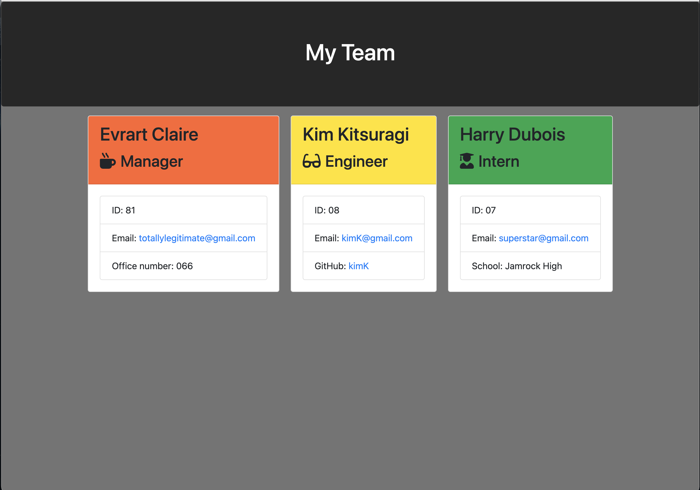

# team_generator_app
  ##  
    
  ## Table of Contents:
  <ol>
  <li><a href="#description">Description</a></li>
  <li><a href="#installation">Installation</a></li>
  <li><a href="#usage">Usage</a></li>
  <li><a href="#contributing">Contributing</a></li>
  <li><a href="#testing">Testing</a></li>
  <li><a href="#questions">Questions</a></li>
  <li><a href="#license">License</a></li>
  </ol>
  
  ## Project Description:
  
  This repository only shows one commit because something broke with my other repo and I can't push to it anymore but here's the link: https://github.com/BeeNorrg/team_profile_generator

  A command-line application built using node.js and inquirer that prompts the user to construct a development team and then utilizes their input to construct html that will display the team's information for easy access. 
  ## Installation Instructions:
  clone this repository and open it in your favorite code-editing software, open your terminal and swap directory to develop. After doing that install the necessary dependencies by typing "npm i". Once everything is instally, type "node app.js" to start making your team!
  ## Usage Instructions: 
  
  Enter "node app.js" in your terminal to start the application. It will prompt you if you want to make a team. If you say yes, it will prompt you to select team members starting with the manager. You can end the application by entering no when prompted to add another team member. Once you end it, it will output the "employees" array as an html doc in the output folder. Open it in browser to view your team!
  ## How you can Contribute:
  If you would like to contribute to this tiny application in any way please reach out via email.
  ## Testing:
  Please make sure to update tests as appropriate.  
  
  ## Questions:
  Do you have any questions?  Check out my Github!:
  www.github.com/BeeNorrg
  Contact me via email at brandon.n.norrgard@gmail.com
  
  ## License:
  Licensed unde the MIT license.